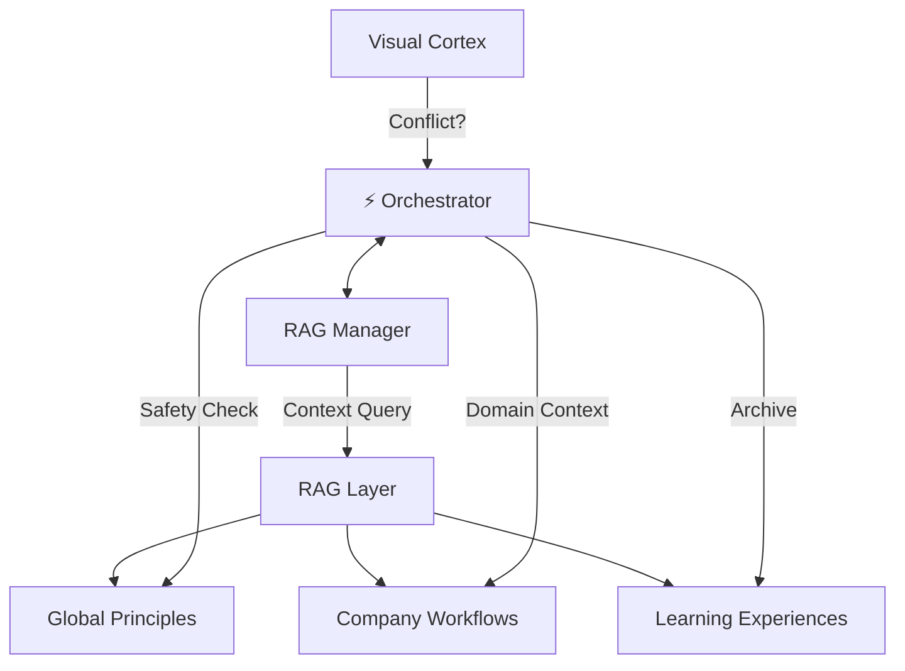

# ARAFURA — Governed Cognitive Infrastructure (v5.1)

> **Sistema de Cognición Multimodal | Capa RAG Corporativa | Gobernanza & Autonomía (SIMA)**

```
 ╔═══════════════════════════════════════════════════════════════╗
 ║                         ARAFURA                               ║
 ║           RAG Corporativo × Visión Pro × Gobernanza           ║
 ║                                                               ║
 ║   "I don't just act on what I see; I act on what I know."     ║
 ╚═══════════════════════════════════════════════════════════════╝
```

## 🧭 ¿Qué es ARAFURA v5.1?

**ARAFURA** ha evolucionado de un agente reactivo a una **Infraestructura de Conocimiento Gobernada**. Esta versión se centra en la escalabilidad empresarial y el aprendizaje estructurado:

*   **🧠 Capa RAG Corporativa**: Estructura de conocimiento en Markdown (.md) organizada por empresas, principios globales y experiencias tácticas.
*   **⚖️ Gobernanza MD**: Sistema de "fuentes de verdad" inmutables. ARAFURA consulta sus principios de seguridad y workflows corporativos antes de cada acción crítica.
*   **🛡️ Conflict Protocol**: Mecanismo de seguridad que detiene el sistema si el conocimiento histórico (RAG) choca con la realidad visual actual.
*   **🎯 Tactical Panel v5.1**: Interfaz web optimizada con botones reactivos, visión de precisión (Lupa) y un overlay de autonomía que no obstruye la visión del Cortex.

---

## 🏗️ Arquitectura de Conocimiento (RAG)

El sistema utiliza una capa de RAG gobernada para asegurar la alineación con los objetivos humanos:



---

## 🚀 Quick Start

### Requisitos
*   **Python 3.10+**
*   **Ollama** instalado y corriendo (`ollama serve`).
*   Modelos recomendados: `deepseek-r1`, `llava`, `mistral`.

### Instalación & Ejecución
1. Clonar y configurar entorno: `python -m venv venv && .\venv\Scripts\activate`
2. Instalar dependencias: `pip install -r requirements.txt`
3. Lanzar arquitectura híbrida: `python terminals/cli/arafura_cli.py` (Opción 3).

---

## 👁️ Control Táctico y Autonomía

ARAFURA implementa una interfaz de control de misión avanzada:

| Funcionalidad | Descripción |
| :--- | :--- |
| **Visión (👁️)** | Activa el procesamiento visual y la mira de precisión (Lupa). |
| **Autonomía (🤖)** | Inicia el bucle autónomo con contador persistente y feedback local. |
| **Reset (🛑)** | Emergencia: detiene procesos y limpia la interfaz instantáneamente. |
| **Precision View** | Ventana de alta resolución (500x500px) que sigue el foco de la IA. |

---

## ⌨️ Comandos RAG y Operación

### Comandos de Sistema

| Comando | Función |
| :--- | :--- |
| `/actua [s]` | Lanza autonomía por N segundos. Ahora consulta el RAG para buscar guías. |
| `/leer <file>` | Carga documentos temporales en memoria. |
| `/mode [chat/vision]` | Cambia el estado cognitivo (Sincronizado con UI Web). |

### Governanza de Datos (`core/rag/`)

*   **Global**: Principios básicos de ética y seguridad (inmutables por la IA).
*   **Companies**: Workflows específicos por cliente (ej: `companies/fdfont/workflows.md`).
*   **Experiences**: Almacén de aprendizajes, sugerencias y patrones de error detectados.

---

## 📜 Filosofía v5.1 "Human-in-the-Loop"

Ninguna acción estructural se ejecuta sin revisión humana. El RAG de ARAFURA es **consultivo**, no ejecutivo. La realidad visual del **Cortex** es la verdad primordial, y la ética de los **Principios MD** es la guía absoluta.

> *"We act safely on what we know."* - ARAFURA v5.1
